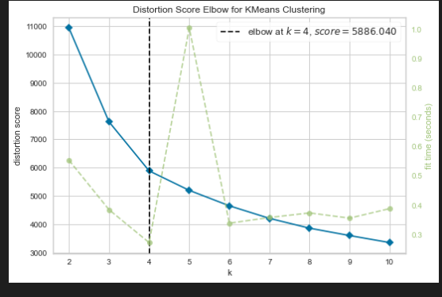
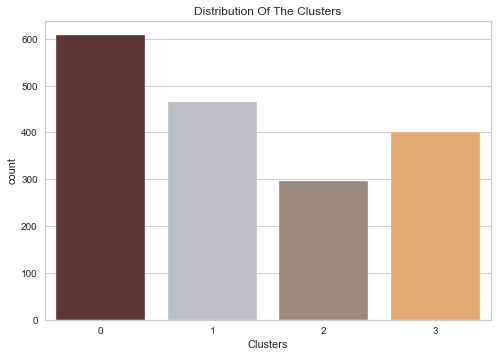
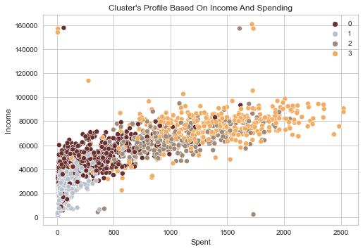
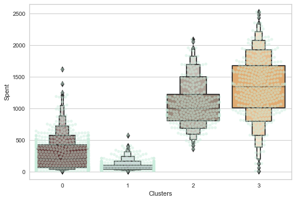
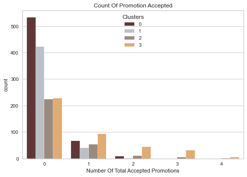
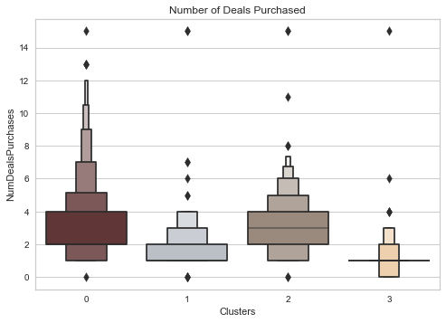

# Customer Segmentation: Clustering 🛍️🛒🛒

- performing an unsupervised clustering of data on the customer's records from a groceries firm's database. Customer segmentation is the practice of separating customers into groups that reflect similarities among customers in each cluster. 
- I will divide customers into segments to optimize the significance of each customer to the business. 
- To modify products according to distinct needs and behaviours of the customers. It also helps the business to cater to the concerns of different types of customers.

## Data Cleaning process

- There are missing values in income
- Dt_Customer that indicates the date a customer joined the database is not parsed as DateTime
- There are some categorical features in our data frame; as there are some features in dtype: object). So we will need to encode them into numeric

## Feature Engineering/ Feature Transformation 

- Creating a feature ("Customer_For") of the number of days the customers started to shop in the store relative to the last recorded date

- Extract the "Age" of a customer by the "Year_Birth" indicating the birth year of the respective person.

- Create another feature "Spent" indicating the total amount spent by the customer in various categories over the span of two years.

- feature "Living_With" out of "Marital_Status" to extract the living situation of couples.

- Create a feature "Children" to indicate total children in a household that is, kids and teenagers.

- To get further clarity of household, Creating feature indicating "Family_Size"

- Create a feature "Is_Parent" to indicate parenthood status

-  "Education" by simplifying its value counts.

- Dropping some of the redundant features

## Data Preprocessing

- Label encoding the categorical features

- Scaling the features using the standard scaler

- Creating a subset dataframe for dimensionality reduction

 

## DIMENSIONALITY REDUCTION
In this problem, there are many factors on the basis of which the final classification will be done. These factors are basically attributes or features. The higher the number of features, the harder it is to work with it. Many of these features are correlated, and hence redundant. This is why I will be performing dimensionality reduction on the selected features before putting them through a classifier.

__PCA__ : is a technique for reducing the dimensionality of such datasets, increasing interpretability but at the same time minimizing information loss.

## Clustering
performing clustering via Agglomerative clustering. Agglomerative clustering is a hierarchical clustering method. It involves merging examples until the desired number of clusters is achieved.

#### Steps involved in the Clustering
 - Elbow Method to determine the number of clusters to be formed
 - Clustering via Agglomerative Clustering
 - Examining the clusters formed via scatter plot

 

 elbow method results in number of clusters = 4

 ## Evaluation/Conclusion

Since this is an unsupervised clustering. We do not have a tagged feature to evaluate or score our model. The purpose  is to study the patterns in the clusters formed and determine the nature of the clusters' patterns.

*The clusters seem to be fairly distributed.*

__Income vs spending plot shows the clusters pattern__ 
- group 0: high spending & average income
- group 1: high spending & high income
- group 2: low spending & low income 
- group 3: high spending & low income

__the detailed distribution of clusters as per the various products in the data. Namely: Wines, Fruits, Meat, Fish, Sweets and Gold__

*it can be clearly seen that cluster 1 is our biggest set of customers closely followed by cluster 0. We can explore what each cluster is spending on for the targeted marketing strategies.*

__exploring how did our campaigns do in the past__

*There has not been an overwhelming response to the campaigns so far. Very few participants overall. Moreover, no one part take in all 5 of them. Perhaps better-targeted and well-planned campaigns are required to boost sales.*

__deal offers__

*Unlike campaigns, the deals offered did well. It has best outcome with cluster 0 and cluster 3. However, our star customers cluster 1 are not much into the deals. Nothing seems to attract cluster 2 overwhelmingly*

## Profiling
Profiling the clusters formed and come to a conclusion about who is our star customer and who needs more attention from the retail store's marketing team.

To decide that I will be plotting some of the features that are indicative of the customer's personal traits in light of the cluster they are in. On the basis of the outcomes, I will be arriving at the conclusions.

__Note__: plotted KDE plot for each of the traits.

__Conclusion__:

- CLUSTER 1
    - parent
    - max 4 members and atleast 2 members in the family
    - subset of single parent
    - most have teenager at home
    - relatively older

- CLUSTER 2
    - not parent
    - at max 2 members in the family
    - majority of couples over single people
    - span of all ages
    - high income group

- CLUSTER 3
    - majority are parents
    - max 3 members in the family
    - majority have one kid
    - relatively younger

- CLUSTER 4
    - parent
    - Max 5 members and atleast 2
    - majority have teenage at their home
    - relatively older
    - low income group

